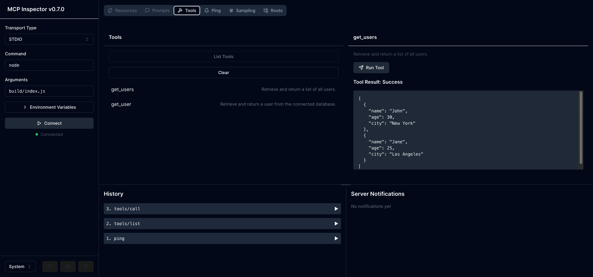

# A simple MCP Server

A Model Context Protocol (MCP) server implementation that provides tools for user data management.

<div align="center">
  
</div>

## Features

- User data retrieval tools
- TypeScript implementation
- ES Modules support
- Built-in TypeScript compilation

## Prerequisites

- Node.js (v20 or higher)
- npm (v9 or higher)

## Installation

1. Clone the repository:
```bash
git clone https://github.com/fujahgabriel/simple-mcp-server.git
cd simple-mcp-server
```

2. Install dependencies:
```bash
npm install
```

## Development

### Building the Project

To build the TypeScript files:
```bash
npm run build
```

This will:
- Compile TypeScript files to JavaScript
- Output files to the `build` directory
- Set proper permissions on the output files

### Development Mode

To watch for changes and automatically rebuild:
```bash
npm run watch
```

### Using the MCP Inspector

To inspect and test your MCP server tools:

1. First build the project:
```bash
npm run build
```

2. Start the MCP Inspector:
```bash
npm run inspector
```

3. The inspector will be available at `http://localhost:5173`

## MCP Configuration

To use this MCP server with Cursor, you need to configure it in your MCP settings. Add the following configuration to your `~/.cursor/mcp.json`:

```json
{
  "my-mcp-server": {
    "math": {
      "command": "node",
      "args": ["build/index.js"]
    }
  }
}
```

Make sure to:
1. Build the project first using `npm run build`
2. Use the correct path to the built JavaScript file
3. Restart Cursor after updating the configuration

## Available Tools

### get_users
Retrieves a list of all users.

### get_user
Retrieves a specific user by name.

Parameters:
- `user`: string - The name of the user to retrieve

## Project Structure

```
mcp-server/
├── build/           # Compiled JavaScript files
├── index.ts         # Main server implementation
├── package.json     # Project dependencies and scripts
└── tsconfig.json    # TypeScript configuration
```

## Dependencies

- `@modelcontextprotocol/sdk`: MCP SDK for server implementation
- `dotenv`: Environment variable management
- `typescript`: TypeScript compiler
- `zod`: Runtime type validation

## License

MIT
